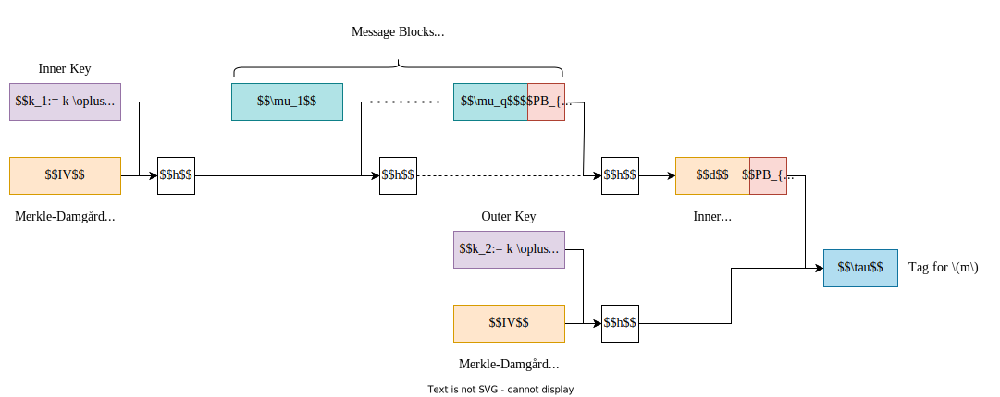

# Hash-Based MACs (HMAC)
The most widely used MAC system today is Hash-MAC (HMAC). It uses a keyless [Merkle-Damgård](../../Hash%20Functions/Merkle-Damgård%20Transform.md) hash function $H$ built from a compression function $h(\textit{input}: \textbf{str}[\textbf{fixed } l]) \to \textbf{str}[\textbf{fixed } l_{\text{out}}]$. 

The construction itself is byte-oriented - the inputs for the underlying Merkle-Damgård function $H$ are assumed to be $B \coloneqq l/8$ bytes in length. HMAC uses a key $k$ of arbitrary length to derive two keys $k_1, k_2$. The keys $k_1$ and $k_2$ are derived by XOR-ing the master key $k$ with two constants `ipad` and `opad`.

$$k_1 = k \oplus \textit{ipad}$$
$$k_2 = k \oplus \textit{opad}$$

The constant `ipad` ("inner pad") is the byte `0x36` repeated to match the key's length in bytes, and, similarly, `opad` ("outer pad") is the byte `0x5C` repeated to match $k$'s byte length, too.

The MAC's signing algorithm is then defined as follows:

$$\textit{Sign}(k, m) \coloneqq H(k_2 || H(k_1|| m))$$

The first "inner key" $k_1$ is prepended to the message $m$ and this concatenation is hashed with the Merkle-Damgård function $H$. Subsequently, the "outer key" $k_2$ is prepended to the resulting digest $d$ and is passed to $H$ one last time to produce the tag $\tau$ for the message $m$. When "expanded" into its Merkle-Damgård implementation, the algorithm looks like following. 



Since this is a deterministic MAC system, the canonical [verification algorithm](Notes/Cryptography/Private-Key%20Cryptography/Message%20Authentication%20Codes%20(MACs)/index.md#implementing-macs) can be used.

### Security of HMAC
Using a [collision resistant](../../Hash%20Functions/Security%20Definitions.md) [hash function](../../Hash%20Functions/index.md) $H$ is actually *not* enough to prove that HMAC is a secure MAC. However, HMAC *can* be proven strongly unforgeable if the Merkle-Damgård function $H$ uses a compression function $h$ that is a [pseudorandom function (PRF)](../../Primitives/Pseudorandom%20Function%20Generators%20(PRFGs).md), for example a [Davies-Meyer function](../../Hash%20Functions/Davies-Meyer%20Transform.md).

```admonish info title="Theorem: HMAC Security"
An HMAC construction is strongly unforgeable, as long as the underlying compression function $h$ is a pseudorandom function.
```

```admonish check collapsible=true title="Proof: HMAC Security"
TO BE FOUND
```