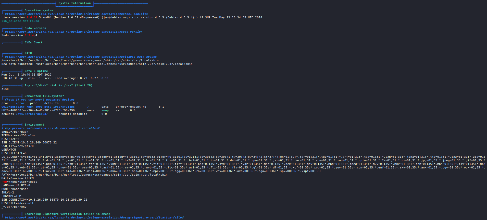
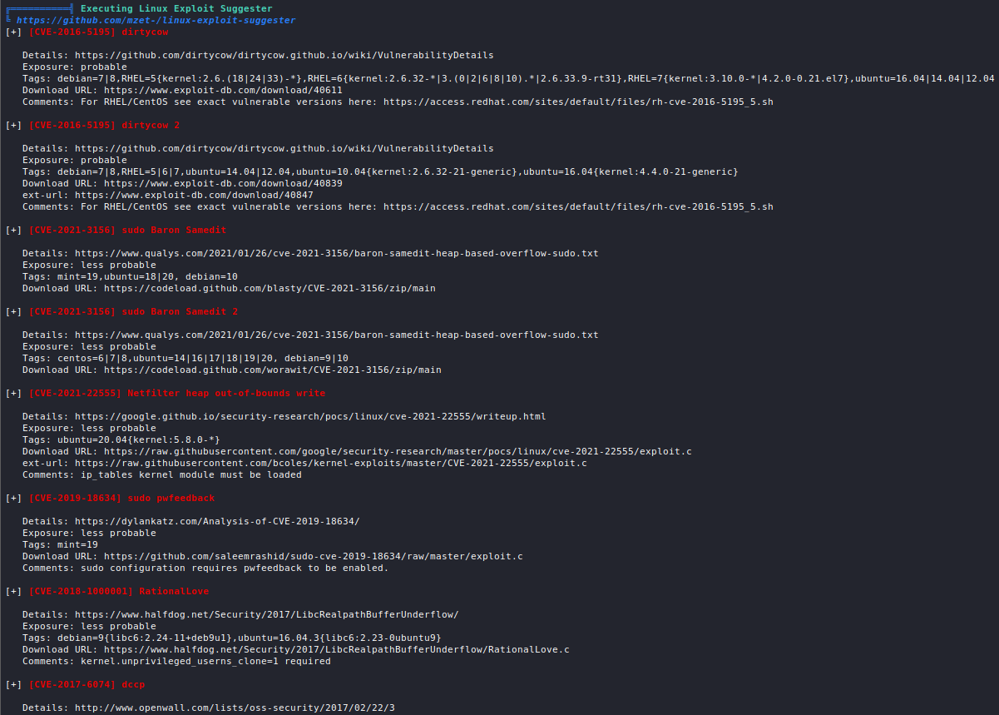
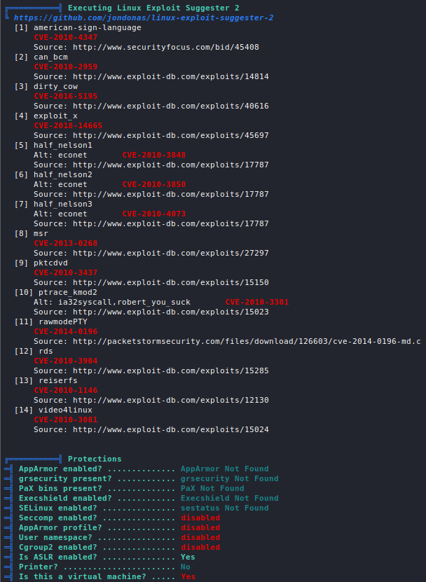
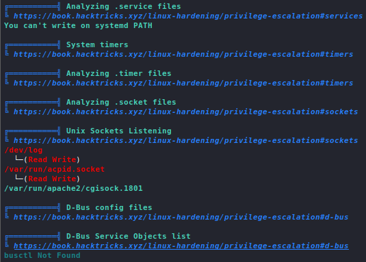
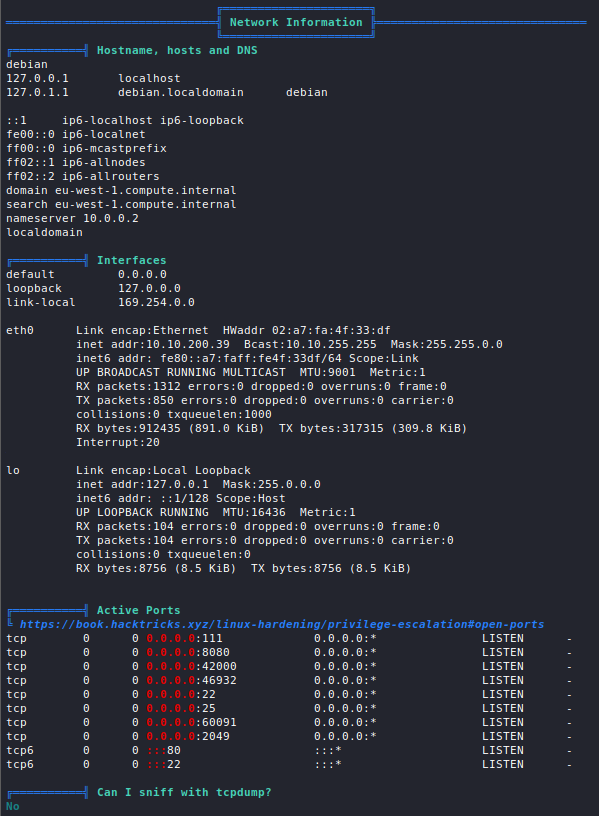

# Introduction
There are plenty of tools which can be used for automating post-exploitation enumeration on Linux machines.

## Linux Enumeration with LinPEAS
[LinPEAS](https://github.com/carlospolop/PEASS-ng/tree/master/linPEAS) is an amazing tool for automation enumeration. It is written in Bash which means that it requires no additional dependencies and can be freely run. In order to acquire the latest version of LinPEAS, run the following command:
```bash
wget https://github.com/carlospolop/PEASS-ng/releases/latest/download/linpeas.sh
```


By default, running LinPEAS will perform many checks on the system and spit out a deluge of information. However, the tool can also be used to only perform specific tasks using the `-o` argument.

Enumerate system information:
```bash
./linpeas.sh -o system_information
```





Enumerate containers on the machine:
```bash
./linpeas.sh -o container
```


Enumerate cloud platforms:
```bash
./linpeas.sh -o cloud
```


Enumerate available software:
```bash
./linpeas.sh -o software_information
```


Enumerate processes, cronjobs, services, and sockets:
```bash
./linpeas.sh -o procs_crons_timers_srvcs_sockets
```




Enumerate network information:
```bash
./linpeas.sh -o network_information
```



Enumerate user information:
```bash
./linpeas.sh -o users_information
```


Enumerate interesting files:
```bash
./linpeas.sh -o interesting_files
```