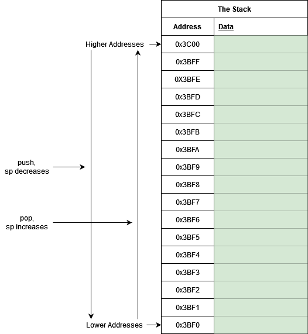

# The Stack
The stack is a place in memory. It's a Last-In-First-Out (LIFO) data structure, meaning that the last element to be added will be the first to get removed. Each process has access to its own stack which isn't bigger than a few megabytes. Adding data to the stack is called *pushing* onto the stack, whilst removing data is called *popping* off the stack. Although the location of the added or removed data is fixed (it's always to or from the top of the stack), existing data can still be read or written to arbitrarily.

A special register is used for keeping track of the *top* of the stack - the stack pointer or `rsp`. When pushing data, the stack pointer *diminishes*, and when removing data, the stack pointer *augments*. This is because the stack grows from higher to lower memory addresses.



# Stack Frames
When a function is invoked, a *stack frame* is constructed. First, the function's arguments which do not fit into the registers are pushed on the stack, then the *return* address is also pushed. Following this, the value of a special register known as the *base pointer* (`rbp`) is saved onto the stack and the value inside the register is then updated to point to the location on the stack where we saved the base pointer.

From then on, the stack pointer is used for allocating local data inside the function and the base pointer is used for accessing this data.

```cpp
long func(long a, long b, long c, long d,
            long e, long f, long g, long h)
{
    long x = a * b * c * d * e * f * g * h;
    long y = a + b + c + d + e + f + g + h;
    long z = otherFunc(x, y);
    return z + 20;
}
```


Sometimes, the base pointer might be completely absent in optimised programs because compilers are good enough in keeping track of offsets directly from the stack pointer.