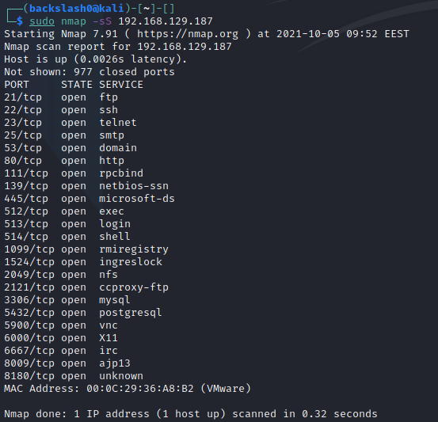
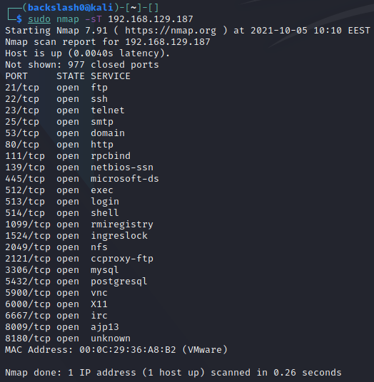

# TCP SYN Scan
- The default scan type with root privileges (`-sS` option)
- It does not complete a full TCP handshake, therefore it's a bit faster and used to be more silent (it is called a silent scan, although that is no longer the case)
- Also known as a half-open scan

You can use the `-sS` option or omit it entirely to perform a TCP SYN scan.

This type of scan works as follows:
Nmap sends a SYN packet to the target, initiating a TCP connection. The target responds with SYN ACK, telling Nmap that the port is accessible. Finally, Nmap terminates the connection before it's finished by issueing a RST packet.

# TCP Connect Scan
- The default scan type when SYN scan isn't available - lacking root privileges (`-sT` option)
- Nmap initiates a complete TCP connection with the target
- The connection attempts are loggen onto the target
- It's usually slower

